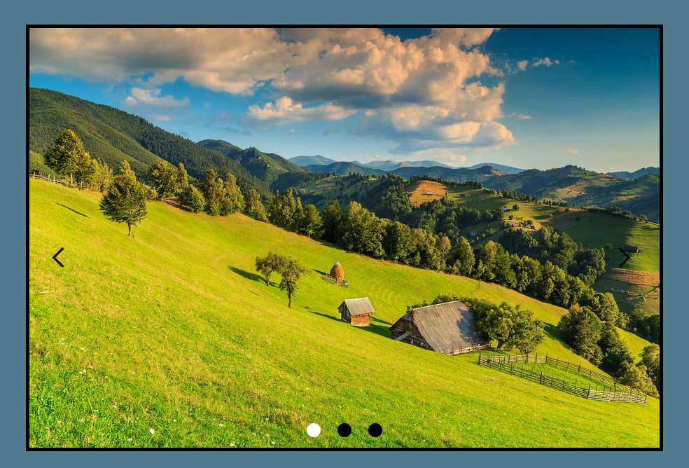

# Carousel

This is a js project based in scrolling images from right to left through an image carousel.

## Table of contents

- [Description](#description)
- [Technologies](#technologies)
- [Installation](#installation)

## Description

This is a js project based in scrolling images from right to left through an image carousel. Each time an image is passed, the lower buttons inside the carousel will be updated, changing their background color.

## Technologies

The project has been created with:

- HTML
- CSS
- JS

## Installation

To run this project, we need the following steps:

- Download and install vscode at the following link: https://code.visualstudio.com/download

- Download the Live Server extension, which is found in the vscode editor

- Once the extension is downloaded, run the extension and everything will work correctly
